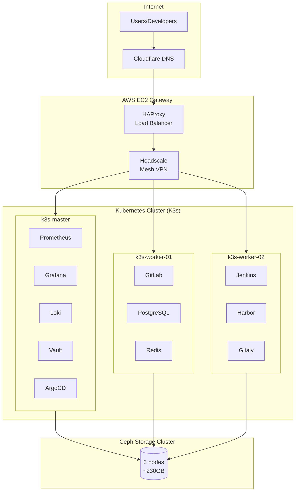
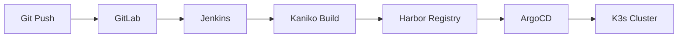

# Production DevOps Infrastructure

> Self-hosted DevOps platform running 12+ production services with GitOps, automated CI/CD, and full observability.

A complete infrastructure stack built for reliability: Kubernetes orchestration, automated pipelines, centralized secrets, and comprehensive monitoring.

## Highlights

| Metric | Value |
|--------|-------|
| Uptime | 99%+ over 6 months |
| Deployment Time | ~5 minutes (commit to production) |
| Monitoring Coverage | 21 Prometheus scrape targets |
| Storage | ~230GB distributed Ceph cluster |
| Services | 12+ production workloads |

## Architecture

## CI/CD Pipeline

| Stage | Tool | Purpose |
|-------|------|---------|
| Source | GitLab CE | Git repository hosting |
| Build | Jenkins + Kaniko | Rootless container builds |
| Registry | Harbor | Image storage + vulnerability scanning (Trivy) |
| Deploy | ArgoCD | GitOps-based continuous deployment |

## How Deployments Work

1. **Developer pushes code** to GitLab repository
2. **Webhook triggers Jenkins** pipeline automatically
3. **Kaniko builds container** image (rootless, no privileged containers)
4. **Image pushed to Harbor** with Trivy vulnerability scan
5. **Jenkins updates image tag** in GitOps repository
6. **ArgoCD detects change** and syncs to cluster (within 3 minutes)
7. **Kubernetes performs rolling update** with zero downtime

## Components

### Kubernetes (K3s)

| Aspect | Details |
|--------|---------|
| Cluster | 1 master + 2 workers |
| Workloads | 12+ production services |
| Ingress | Nginx Ingress Controller |
| Certificates | cert-manager with Let's Encrypt |
| Load Balancer | MetalLB |

### GitOps (ArgoCD)

- Automated sync every 3 minutes
- Self-healing enabled (auto-corrects drift)
- Drift detection and alerts
- Git as single source of truth

### Monitoring Stack

| Tool | Purpose |
|------|---------|
| Prometheus | Metrics collection (21 scrape targets) |
| Grafana | Visualization and dashboards |
| Loki | Log aggregation |
| Alertmanager | Alert routing and notifications |

### Secrets Management (HashiCorp Vault)

- Kubernetes authentication
- Agent Injector for automatic secret injection
- Path-based access policies per service
- Centralized secret storage with audit logging

### Storage (Ceph)

- 3-node distributed cluster
- RBD block storage via CSI driver
- ~230GB total allocation
- Automatic PVC provisioning

### Networking

| Layer | Tool | Purpose |
|-------|------|---------|
| External | HAProxy | L7 load balancing, TLS termination |
| Internal | Headscale | WireGuard-based mesh VPN |
| Security | Network Policies | Namespace isolation |

## Key Design Decisions

| Decision | Reasoning |
|----------|-----------|
| K3s over K8s | Lightweight, suitable for homelab scale |
| Kaniko over Docker-in-Docker | Security: no privileged containers needed |
| ArgoCD over kubectl in CI | Pull-based GitOps, better security, drift detection |
| Vault over K8s Secrets | Centralized management, audit logging, dynamic secrets |
| Ceph over local storage | Data survives node failures, shared across cluster |
| Headscale over public exposure | Zero-trust networking, private mesh |

## Services

| Service | Purpose |
|---------|---------|
| GitLab | Source control & repository hosting |
| Jenkins | CI/CD automation engine |
| Harbor | Container registry with Trivy scanning |
| ArgoCD | GitOps continuous deployment |
| Grafana | Monitoring dashboards & alerting |
| Vault | Secrets management |

## Tech Stack

## Backup Strategy

| Aspect | Details |
|--------|---------|
| Tool | Velero |
| Schedule | Daily automated backups |
| Retention | 30 days |
| Storage | Ceph RGW (S3-compatible) |

## Lessons Learned

1. **GitOps simplifies operations** - Rollbacks are just git reverts
2. **Observability is essential** - Can't fix what you can't see
3. **Security requires layers** - Vault, NetworkPolicies, rootless builds
4. **Distributed storage is complex** - But necessary for high availability

## Roadmap

- [ ] Terraform for AWS infrastructure
- [ ] Multi-environment GitOps (dev/staging/prod)
- [ ] Service mesh implementation (Linkerd)
- [ ] Automated integration testing in pipeline

---

*This infrastructure is actively running and maintained.*
